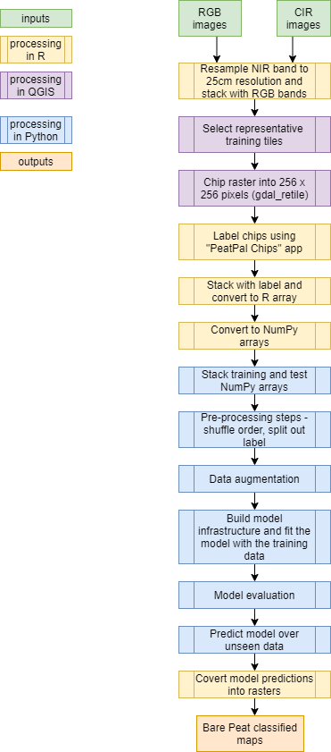
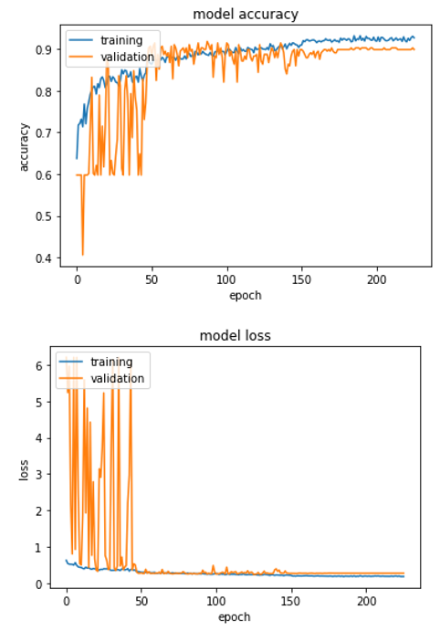

```{r setup, include=FALSE}
knitr::opts_chunk$set(echo = TRUE, eval = FALSE)
```

<div class="mycontent">

## Project Background

This was a proof-of-concept project as part of the data accelerator programme to explore mapping areas of bare peat in aerial photography using deep learning techniques.

This is building on previous methodologies conducted by JNCC using classical programming through derived indices and thresholding values, and using shallow machine learning to classify images. These methods have demonstrated a lot of difficulty in distinguishing bare peat features from similar looking vegetation such as heather, or river courses with heavy sedimentation. There is also variability in the data between capture dates as well with seasonality and differences in the image quality and the angle of capture, and weather and light conditions during the flights. 

Deep learning has demonstrated to be a powerful tool for image classification. It is a subset of machine learning which progressively learns patterns in your data through multiple layers of transformations representing the data in increasingly meaningful ways. Convolutional neural networks perform these transformations by turning off and on different nodes to tell us which elements are important in classifying our particular feature, and then sequentially learn how best to weight these nodes to pick out the feature from unseen images. 


This analysis can aid in the targeting of monitoring and restoration on the ground in peatland areas, providing a cost effective means of assessing visual indicators of the condition of upland peatlands. 

## Analytical environment

Pre-processing of the data (steps 1.1, 1.3-1.5) and writing results back out as rasters was carried out using R version 4.0.5 with the following packages:

* reticulate_1.18 
* RcppCNPy_0.2.10 
* keras_2.4.0     
* rgdal_1.5-23   
* knitr_1.32      
* fasterize_1.0.3 
* sf_0.9-8        
* forcats_0.5.1  
* stringr_1.4.0   
* dplyr_1.0.5     
* purrr_0.3.4     
* readr_1.4.0    
* tidyr_1.1.3     
* tibble_3.1.1    
* ggplot2_3.3.3   
* tidyverse_1.3.1
* renv_0.9.3      
* raster_3.4-5    
* sp_1.4-5      

1.2 and general visualisation of layers was carried out with QGIS version: 3.16 Hannover. 
1.6 (Stacking of the numpy arrays) was carried out with Python 3.8.5 (default, Sep  3 2020, 21:29:08) [MSC v.1916 64 bit (AMD64)] via Jupyter notebook server version 6.1.4. The packages called include:

* numpy 1.19.2 
* pandas 1.1.3  
* os
Step 2 was carried out in Google Colabs using a Python notebook.

```{r packagesetup}
#set up renv package versioning
library(renv)
#initiate renv environment
#renv::init()

# Import packages here
packages <- c('tidyverse','dplyr','raster','sf','fasterize','knitr','rgdal','keras','RcppCNPy','reticulate')

for(i in 1:length(packages)){
   if(!require(packages[i], character.only = T, quietly = T)){
    install.packages(packages[i])
  }
  require(packages[i], character.only = T)
}

#take snapshot to update renv library
renv::snapshot()

```

## Method overview

<i>Figure 1: A diagram of the workflow steps and environment these were carried out in.</i>

```{r Figure1, echo=F,eval=T, out.width='30%'} 

```

## Datasets used

```{r datasets, echo=F,eval=T}
knitr::kable(tibble::tribble(~DataLayer,~Description,~DataOwner, ~Format, ~SpatialResolution,  ~TemporalResolution, ~CRS, ~Licence,
  'Aerial photography GB (APGB) - RGB images ',
  'tiled aerial photography containing the red, green and blue bands.',
  'Bluesky/Getmapping Ltd.',
  '3band raster, tif',
  '25cm',
  '2018',
  'OSGB 1936(EPSG:27700)',
  'Under Public Sector Geospatial Agreement',
  
  'Aerial photography GB (APGB) - CIR images ',
  'tiled coloured infrared images containing the near-infrared, red and green bands.',
  'Bluesky/Getmapping Ltd.',
  '3band raster, tif',
  '50cm',
  '2018',
  'OSGB 1936(EPSG:27700)',
  'Under Public Sector Geospatial Agreement',
  
  ))
  
```
  
## Site Location

The Peak district in England was chosen for this analysis due to previous methodology testing having been carried out around the Dark Peat site and data availability.

## Detailed Method steps

### 1. Create training data
<p>
**1.1. Stack the RGB imagery with the near-infrared (NIR) band from the CIR image **
<p>
This involved disaggregating the NIR to 25cm spatial resolution to match the RGB image resolution and then adding this band to the matching RGB image. These come as 1km2 tiled images (hereafter referred to as "tiles").

```{r imageprocessing}
#Peak District imagery paths
imageryLists <- c('./Bare Peat Mapping/Data/APGB_request/105781_20190705/Aerial Photo/105781-1_RGB_1_Shape',
                     './Bare Peat Mapping/Data/APGB_request/110055_20191023/Aerial Photo/110055-1_RGB_1_Shape',
                     './Bare Peat Mapping/Data/APGB_request/110055_20191023/Aerial Photo/110055-1_RGB_2_Shape')
outPath <- './Data/Imagery/PeakDistrict/Combined tiles/'

#iterate through folders
map(imageryLists,.f=function(folder){
    foldName<- basename(folder)

  if(foldName=='105781-1_RGB_1_Shape'){ #slightly different naming structure between APGB outputs
      CIRName<- paste0(dirname(dirname(folder)),'/CIR','/')
  } else {
          CIRName<- paste0(dirname(dirname(folder)),'/CIR','/',gsub(foldName,pattern='1_RGB',replacement='2_CIR'),'/')
  }
  #makes output folder
  if (!file.exists(paste0(outPath,foldName))){
    dir.create(paste0(outPath,foldName))
  }
  #list aerial photography
  aerial.list <- list.files(paste0(folder),pattern='.tif',full.names=T)
    for (i in 1:length(aerial.list)){
       RGBgran <- raster::stack(aerial.list[i]) # load in RGB image
       CIRgran <- raster::stack(paste0(CIRName,basename(aerial.list[i]))) #load in CIR image
       CIR25cm <- raster::resample(CIRgran,RGBgran,  method = "bilinear") #resample to 25cm res
       gran_all <- raster::addLayer(RGBgran, CIR25cm[[1]]) #add nir band {band 1} to RGB image
       writeRaster(gran_all, filename=paste0(outPath,foldName,'/',basename(aerial.list[i])), datatype="INT2S",overwrite=T) #write out tile
       print(paste(i,"of",length(aerial.list),"done."))
       }
  })
  
```
<p>
**1.2. Collating training and test tiles**
<p>
The images were viewed in QGIS. 10 were selected for a training dataset and 2 to be held back as a test dataset. These were selected being representative tiles containing clearly visible bare peat, and displaying between them varied images of how bare peat looks in the landscape. The temporal and spatial extent should also be considered in this selection, trying to capture a range of imagery capture dates and across the whole region of interest.
<p>
**1.3. Chipping the imagery **
The tiles then needed to be split into smaller rasters of 256 x 256 pixels (hereafter referred to as "chips"). This is to pass the data into the deep learning model as manageable packets of data it can assess. 

<i>Figure 2: A diagram displaying the difference in scale between the "tiles" and the "chips". © Getmapping Plc and Bluesky International Limited [2019] </i>

```{r Figure2, echo=F,eval=T, out.width='60%'} 
knitr::include_graphics('images/ChipDiagram.png')
```

For this the function 'gdal_retile' was used. This was carried out by calling the function through QGIS. Attempts to automate this by calling the python script in R proved tricky due to no executable being available for the function. The experimental code is shown below.

```{r gdalretileAttempt}

#list of tiles to chip
tiles <- list.files('./Data/Imagery/PeakDistrict/TrainingTiles', full.names=T,pattern='tif')

# call iterate through files
for(i in 1:length(tiles)){
  image <- tiles[i]
  gdalRetile(inRaster = image, 
             outFile , #location to save chipped outputs
             OSGeoPath,  #path to OSGeo
             pyPath ) #location of python on local machine
}

##function call
gdalRetile <- function(inRaster, 
                       readToMemory = TRUE, 
                       outFile, 
                       OSGeoPath, 
                       pyPath,
                       connectivity = 4){
  # write out new bat file
  tmp <- getwd()
  fileConn<-file(paste0(tmp,"/gdalRetile.bat"))
  writeLines(paste(normalizePath(pyPath), file.path(OSGeoPath, "apps/Python37/Scripts", "gdal_retile.py %*")),fileConn)
  close(fileConn)
  
  #call bat file in system call
  batPath <- paste0(tmp,"/gdalRetile.bat")
  outFile <- normalizePath(outFile)#output file
  rastPath <- normalizePath(inRaster)#input raster
  
  #check it exists and loads
  if(file.exists(inRaster)==F){stop('file doesnt exist')}
  # Set connectivity switch
  if(connectivity == 8) connectivity <- "-8 " else connectivity <- ""
  
  # Make vector of arguments
  args <- sprintf('%1$s -ps 256 256 -overlap 0 -levels 1 -s_srs EPSG:27700 -r near -ot Float32 -targetDir "%2$s" "%3$s"',
                  connectivity, outFile, rastPath)
  # Run OSGeo function (silence output by setting 'stdout' to TRUE)
  out <- system2(batPath, args = args, stdout = F)
  #outputText <- withr::with_envvar(c(OSGEO4W_ROOT = OSGeoPath), system2(batPath, args = args, stdout = F))
}

```
<p>
**1.4. Labeling the data**
<p>
Once chipped up, the chips were brought in the "Peatpal_chips" R shiny app for labeling. 
<p>
The chipped rasters were copied into the 'Data/Chips' folder of the app. These can then be viewed in the app and labeled using the buttons 'bare' or 'not bare'. The 'skip chip' button will display the next chip in the folder but not remove the current chip, allowing you to come back to this at a later time. In the background, when you click on the 'bare' label, the app will write a new raster layer with the same dimensions and resolution as the tile with every cell containing the value "1", saving this as a new raster in the 'Labels' folder. If 'not bare' is selected this will be written with the value "0". The original chip image will also be moved from the 'Data/Chips' folder to the 'Data/Completed' folder.

<i>Figure 3: A screenshot of the "PeatPal Chips" app. © Getmapping Plc and Bluesky International Limited [2019] </i>

```{r Figure3, echo=F,eval=T, out.width='60%'} 
knitr::include_graphics('images/PeatPalChipsScreenshot.png')
```
<p>
Labels were then checked in QGIS against the whole imagery tile. If in the wider tile context it was thought a chip was incorrectly labelled then this was relabelled either in the app or with the following code. It was good practice to have the imagery open in QGIS whilst labelling, so this check could be performed in parallel alongside labelling in the app.

```{r incorrectlabels}
#training list
chips<- list.files('./Data/Imagery/PeakDistrict/Chips/TrainingChips/') %>% stringr::str_replace('.tif','')
write.csv(chips,'./Data/Imagery/PeakDistrict/train_chip_list.csv')

#overwrite labels where in context they look incorrectly labelled
labelPath <- './Data/Imagery/PeakDistrict/Chips/TrainingLabels'
testList <- read.csv('./Data/Imagery/PeakDistrict/train_chip_list.csv') %>% na.omit()
for (i in 1:nrow(testList)){
  chipLabel <- raster(paste0(labelPath,'/',testList$file[i],'.tif'))
  chipLabel[]<- testList$bare[i]
  writeRaster(chipLabel,paste0(labelPath,'/',testList$file[i],'.tif'),overwrite=T)
}
```

In total:
2560 train samples - bare = 1036, NotBare = 1524
512 test samples - bare = 94, NotBare = 418

<p>

**1.5. Converting into NumPy arrays**
<p>
The training and test rasters were then stacked with the label and converted into R arrays and then saved out as indivdual NumPy arrays for use in python, using the 'RcppCNPy' package.

```{r array}
## Preparing the arrays -process variables:
#Training chips
foldpath <- './Data/Imagery/PeakDistrict/Chips/TrainingChips/'
allFiles <- list.files(foldpath,pattern='tif',full.name=T)
labelpath <- paste0(basename(foldpath),'/TrainingLabels/')
outfold <- './Data/Imagery/PeakDistrict/Arrays/Training/'

#Test chips
foldpath <- './Data/Imagery/PeakDistrict/Chips/TestChips/'
allFiles <- list.files(foldpath,pattern='tif',full.name=T)
labelpath <- paste0(basename(foldpath),'/TestLabels/')
outfold <- './Data/Imagery/PeakDistrict/Arrays/Test/'

## iterate through files to create array (training and test processed separately)
for(i in 1:length(allFiles)){
  name <- allFiles[i]
  chip <- suppressWarnings(brick(name)) #load chip
  label <- suppressWarnings(raster(paste0(labelpath,basename(name)))) #load label
  labelledChip <- raster::addLayer(chip,label) #add label to rasterstack
  names(labelledChip) <- c('Red','Green','Blue','NIR','Label') #give it standard names
  labelledArray <- as.array(labelledChip) #convert to R array
  #check if 256 x 256 pxl size
  dims <- dim(labelledArray)
  #if correct dimensions add to array
  if(dims[1]==256 & dims[2]==256){
    #add to array
  npySave(paste0(outfold,str_replace(basename(name),'.tif',''),".npy"), labelledArray)
  } else { # if dimensions different (e.g. edge) extend shape to fill with NAs
    r <- raster(crs=crs(labelledChip),ext=extent(labelledChip),nrow=256, ncol=256)
    labelledChip_extd <- raster::resample(labelledChip,r) #resample to new extent
    labelledArray <- as.array(labelledChip_extd)
    npySave(paste0(outfold,str_replace(basename(name),'.tif',''),".npy"), labelledArray) #write as numpy array
  }
  cat(paste(i, 'of',length(allFiles),"\r"))
}


```
<p>
**1.6. Stacking NumPy arrays**
<p>
This was carried our in Jupyter notebooks with Python using the notebook 'CompilingArrays.ipynb'. This uses python to read in the individual NumPy arrays and stack them to save them as one NumPy array. This results in one training NumPy array and one test NumPy array.
<p>

### 2. Train Deep learning models

<p>
This was carried out in Google Colabs with a high RAM GPU (25GB) testing out various infrastructures. 
The UNet demonstrated greatest accuracy and could write out both chip level and pixel level predictions.The notebook for this analysis is included in the 'UNet_PixelBasedSementation.ipynb' notebook.
<p>
Steps within this notebook:
<p>
**2.1. Pre-processing the arrays **
<p>
This included randomising the order of the training data and scaling the values between 0-1. These are standard steps with machine learning to make sure order and scale of the variable do not affect the analysis.
<p>
**2.2. Split out validation data**
<p>
10% of the training data were then split out for a separate validation dataset. This is used during each iteration of the deep learning model (epoch) in order to assess the weights of the model and how well it is performing on an unseen dataset. This is evaluated and the weights adjusted accordingly, with the aim being to reduce the loss and increase the accuracy of the validation dataset as the model trains. Additional callback functions which aid in training the model also rely on this dataset.
<p>
**2.3. Data augmentation steps **
<p>
Data augmentation is where you transform your images in order to vary and increase your training dataset size making your model more robust and less prone to overfitting. This can include such as flipping your images, altering the brightness, rotating the image, or zooming in and rescaling certain parts of the image. Here we testing a range of transformations and with the final model only applied a simple horizontal flip as this seemed to perform best.
<p>
**2.4. Building and fitting the model infrastructure **
<p>
Several different deep learning infrastructures were trialed. The final model was run with a Unet infrastructure, which is an example of a weakly supervised segmentation model with our training levels at the chip level, but output predictions being made both at the chip and at the pixel level. Early stopping and learning rate reduction callbacks were added to help ensure the model trains for longer. This was with the following parameters.
<br>

Early stopping:

* monitoring: 'val_loss'
* patience: 100
* restore_best_weights = TRUE
<p>
Learning rate reduction:

* monitoring: 'val_loss'
* factor: 0.1
* patience: 25
<p>
batch size: 32
epochs: 300
steps_per_epoch:len(x_training)/ batch_size
<p>

After fitting, the model was evaluated against the test dataset, with the test loss and accuracy metrics assessed.
The optimal threshold to split the resulting class percentage into bare and non-bare results were found using the test dataset and the precision recall curve metric in the 'sklearn.metrics' library. This calculates the optimal threshold based on the harmonic mean (balance across precision and recall). The models were also evaluated using a confusion matrix withe the model history plotted to show how the training and validation datasets performed over all the epochs, as the model was being fit. 

<i>Figure 4: A plot of the model history showing how the model accuracy and loss varied with the training and validation datasets over epochs.</i>

```{r Figure4, echo=F,eval=T, out.width='60%'} 

```

### 3. Making predictions

**3.1. Running the model predictions **
Noted in teh 'UNet_PixelBasedSementation.ipynb' notebook, both chip level and pixel level predictions were made with the model running the predict function over the relevant model. For the chip level mode this produced a data frame with each chip either present (1) or absent (0) noted as to if bare peat was present. This is given in the order the chips are read in.
For the pixel level predictions, an array is written out giving the 0 and 1 values per pixel in the chip raster. This is saved out from the script as a numPy array.

**3.2. Write out image level predictions spatially**

The image predictions were then brought back into R and converted from a dataframe of predictions per chip into raster layers

```{r chipPredictions}

#function definition
DLpred <- function(pred,chipfolder,outfolder){
  predictions <- read.csv(pred) %>% select(-X) #read in csv predictions
  names(predictions)[1]<-'predict'
  if(!'filename' %in% names(predictions)){
    names <- list.files(chipfolder) %>% str_replace('.tif','') #list filenames
    predictions$filename <- names
  }
  #iterate through rewriting chips with predictions:
  for (i in 1:nrow(predictions)){
    file <- predictions[i,] #get prediction
    tile <- raster(paste0(chipfolder,str_replace(file$filename,'.npy',''),'.tif')) #get chip
    if(file$predict=='False'){
      tile[]<-0 #fill with 0 where no bare peat present
      } else{ 
        tile[]<-1 #fill with 1 where bare peat present
        }
    writeRaster(tile,paste0(outfolder,str_replace(file$filename,'.npy',''),'_pred.tif'),overwrite=T) #write out prediction raster
    }
}

#Peak district
DLpred(pred ='./Models/UNet3/UNet3_imgpredictions.csv',
       chipfolder='./Data/Imagery/PeakDistrict/Chips/TestChips/',
       outfolder='./Models/UNet3/Chip_predictions/')

```

**3.3. Write out pixel level predictions spatially**

The pixel level predictions were also brought back into R and converted from numPy arrays into raster layers

```{r pixelPredictions}
#set up
np<- import("numpy", convert=FALSE)
array <- np$load('./Models/UNet3/UNet3_predictions.npy') #load in array
testfiles <- list.files('./Data/Imagery/PeakDistrict/Chips/TestChips/',full.names = T) #create a list of chips
outfold <- './Models/UNet3/test2/Pixel_predictions/' #folder to save output

#iterate over chip files
for(i in 1:length(testfiles)){
  chip_preds <- array[i-1] #NumPy dot notation begins at 0
  chip <- raster(testfiles[i]) # load in raster
  dims <- dim(chip)
  #check if chip dimensions are 256 x 256
  if(dims[1]==256 & dims[2]==256){
    chip_new <- setValues(chip,as.matrix(chip_preds))#if correct dimensions add to array
    writeRaster(chip_new,paste0(outfold,str_replace(basename(testfiles[i]),'.tif','_pred.tif')),overwrite=T)
  } else{ #if edge chip
    chipExt <- raster(crs=crs(chip),ext=extent(chip),nrow=256, ncol=256) #create chip full size
    chip_new <- setValues(chipExt,as.matrix(chip_preds)) #set prediction values
    chip_crop <- raster::resample(chip_new,chip) # resample to cropped size
    writeRaster(chip_crop,paste0(outfold,str_replace(basename(testfiles[i]),'.tif','_pred.tif')),overwrite=T)
  }       
}
```

## Results 

UNet was the best performing model infrastructure for the analysis with a model accuracy of 92%. At the pixel level, the predictions demonstrated good positive detection for the feature and not a lot of misclassification with other features in the imagery.

<i>Figure 5: A plot of the predictions for an unseen area over the Peak District. </i>

```{r Figure5, echo=F,eval=T, out.width='60%'} 
knitr::include_graphics('images/PeakDistrictClassified.png')
```

## Testing with an unseen Yorkshire site

As well as evaluating the models as it was training against the validation dataset and after training against the test dataset, the model was also used to predict over imagery from the Yorkshire moors captured at a similar period. This was to see how transferable the same model was across an unseen upland area. The predictions demonstrated high accuracy in this unseen area, with an accuracy of 0.830 and loss 0.883. 

```{r Yorkshire}
# 1.1. stack RGB imagery with NIR band
folder <- './Data/Imagery/Yorkshire/RGB/'
outPath <- './Data/Imagery/Yorkshire/Combined/'
#list aerial photography
aerial.list <- list.files(paste0(folder),pattern='.tif',full.names=T)
    for (i in 1:length(aerial.list)){
       RGBgran <- raster::stack(aerial.list[i])
       CIRgran <- raster::stack(paste0(dirname(folder),'/CIR/',basename(aerial.list[i])))
       CIR25cm <- raster::resample(CIRgran,RGBgran,  method = "bilinear") #resample CIR to 25cm
       gran_all <- raster::addLayer(RGBgran, CIR25cm[[1]])
       writeRaster(gran_all, filename=paste0(outPath,basename(aerial.list[i])), datatype="INT2S",overwrite=T)
       print(paste(i,"of",length(aerial.list),"done."))
    }

# 1.4. labelling carried out in PeatPal chips app.

# 1.5. converting into an array
foldpath <- './Data/Imagery/Yorkshire/Chips/TestChips/'
allFiles <- list.files(foldpath,pattern='tif',full.name=T)
labelpath <- paste0(basename(foldpath),'/TestLabels/')
outfold <- './Data/Imagery/Yorkshire/Arrays/'

#iterate through files to create array
for(i in 1:length(allFiles)){
  name <- allFiles[i]
  chip <- suppressWarnings(brick(name))
  label <- suppressWarnings(raster(paste0(labelpath,basename(name))))
  labelledChip <- raster::addLayer(chip,label) #add label to rasterstack
  names(labelledChip) <- c('Red','Green','Blue','NIR','Label') #give it standard names
  labelledArray <- as.array(labelledChip) #convert to R array
  #check if 256 x 256 pxl size
  dims <- dim(labelledArray)
  #if correct dimensions add to array
  if(dims[1]==256 & dims[2]==256){
    #add to array
  npySave(paste0(outfold,str_replace(basename(name),'.tif',''),".npy"), labelledArray)
  } else { # else extend shape to fill
    r <- raster(crs=crs(labelledChip),ext=extent(labelledChip),nrow=256, ncol=256)
    labelledChip_extd <- raster::resample(labelledChip,r)
    labelledArray <- as.array(labelledChip_extd)
    npySave(paste0(outfold,str_replace(basename(name),'.tif',''),".npy"), labelledArray)
  }
  cat(paste(i, 'of',length(allFiles),"\r"))
}


#3.2.model predictions - writing out chip level predictions
DLpred(pred ='./Models/UNet3/Yorkshire/Yorkshire_imgpredictions.csv',
       chipfolder='./Data/Imagery/Yorkshire/Chips/TestChips/',
       outfolder='./Models/UNet3/Yorkshire/Chip_predictions/')

#3.3.model predictions - writing out chip level predictions
#npy_pred_array <- './Models/UNet3/Yorkshire/Yorkshire_pxlpredictions.npy'
#testfiles <- list.files('./Data/Imagery/Yorkshire/Chips/TestChips/',full.names = T)
#outfold <- './Models/UNet3/Yorkshire/Pixel_predictions/'

```

<i>Figure 6: A plot of the model history showing how the model accuracy and loss varied with the training and validation datasets over epochs.</i>

```{r Figure6, echo=F,eval=T, out.width='60%'} 
knitr::include_graphics('images/YorkshireClassified.png')
```

## Limitations and Recommendations

*	Further evaluation with upland imagery to see the usability of the model with different sites and different capture dates 
*	Further development of the shiny app to ensure efficiency and accuracy when creating the training labels
*	If possible, comparison with available ground truth data or site expertise
*	Trialing with other types of imagery such as VHR data


